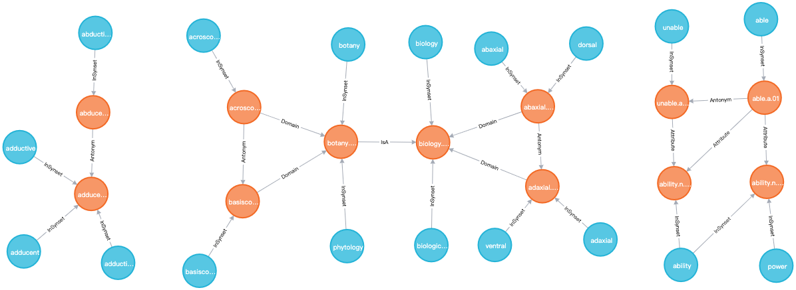
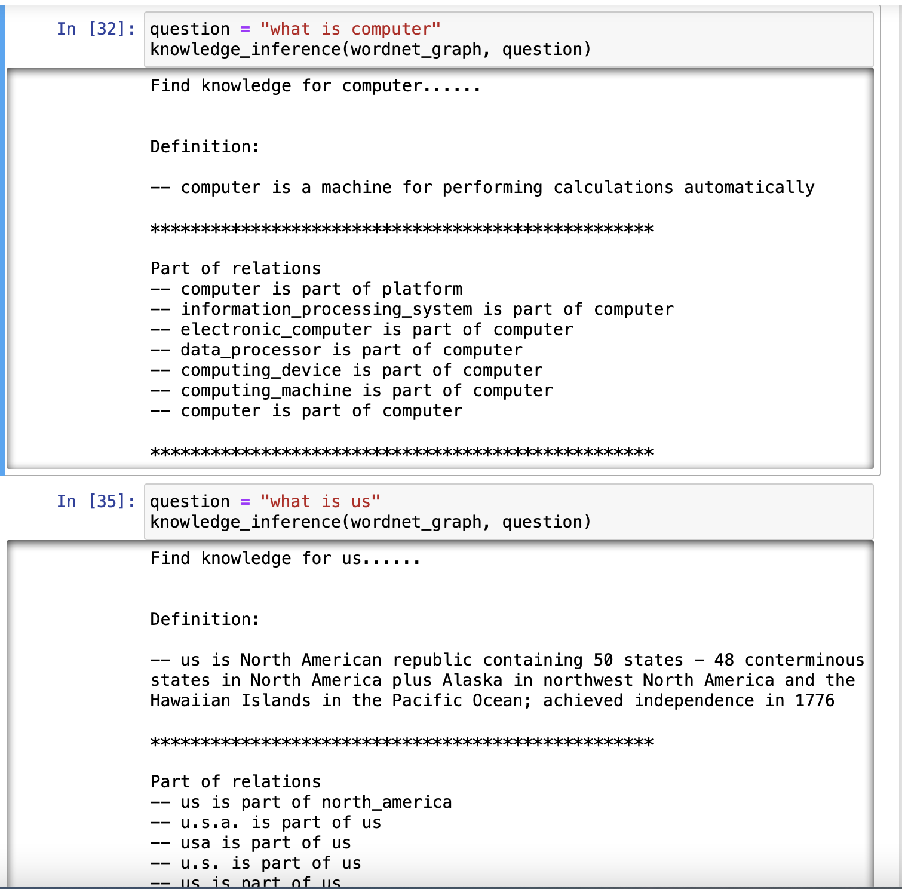
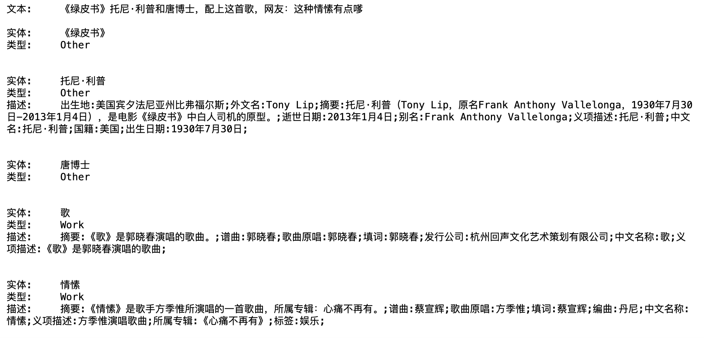

# KnowledgeGraph
本项目把多个独立的知识图谱项目聚集在一起，便于管理。欢迎参考！

## 项目1 基于WordNet构建的英语词汇实体和同义词集实体知识图谱
+ 详情点击：[wordnet_based_kg](./wordnet_based_kg)
+ 效果预览

+ 词汇问答应用

## 项目2 基于BiLSTM-Attention算法的实体链接
+ 详情点击：[entity_link](./entity_link)
+ 效果预览

## 项目3 CCKS&百度 2019中文短文本的实体链指 第一名解决方案(引用FREE成果)
+ 详情点击：[entity_link_ccks_baidu](./entity_link_ccks_baidu)

## 项目4 豆瓣电影知识图谱
+ 详情点击[movie_kg](./movie_kg)
+ 效果预览

